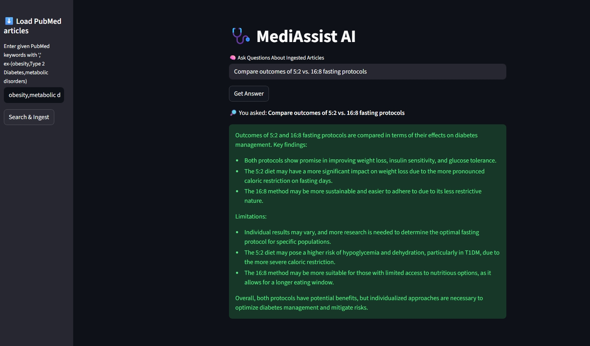

# 🩺 MediAssist AI <p style='font-size:12px; color:gray;'> Q&A for Intermittent Fasting </p>


**MediAssist AI** is an intelligent healthcare chatbot developed to support clinicians and researchers in navigating the complex landscape of **intermittent fasting (IF)** as a treatment for obesity, Type 2 Diabetes, and metabolic disorders. Built for **MediInsight**, a preventive healthcare analytics company, this system delivers **concise, evidence-based answers** to pressing questions—saving time and improving decision-making.

## 🚀 Overview

This project enables users to:
- Ask clinical questions related to intermittent fasting.
- Retrieve evidence-based summaries from peer-reviewed sources.
- Compare fasting protocols (e.g., 16:8, 5:2, alternate-day).
- Save time with AI-powered insights and source attribution.

---
## 🚨 Real-World Challenges in Research

Clinicians exploring intermittent fasting (IF) face:

- A flood of conflicting, often non-peer-reviewed studies  
- No clear consensus across fasting methods (16:8, 5:2, alternate-day)  
- Limited time to sift through dense research  

Even a simple query like “Is 16:8 effective for Type 2 Diabetes?” can lead to hours of reading.

## 💡 The Solution: MediAssist AI

With MediAssist AI, clinicians can ask:

**“Is 16:8 fasting effective for reversing insulin resistance?”**

And instantly receive:

- A concise, evidence-based summary  
- A comparison across fasting protocols  
- Key limitations and clinical relevance  

All delivered in seconds—saving time and improving care.


---



---


## ✨ Features

- 🔍 **Clinical Q&A Engine**: Accepts natural language queries from healthcare professionals.
- 📚 **Evidence Summarizer**: Converts dense research into digestible insights.
- 🧭 **Protocol Comparator**: Highlights differences and outcomes across fasting methods.
- 🧠 **LLM Integration**: Uses transformer-based models to generate contextual answers with references.
- 🗃️ **Vector Store**: Stores embeddings in ChromaDB for efficient retrieval.

---

## ⚙️ Setup Instructions

1. **Install dependencies**
    ```bash
    pip install -r requirements.txt
    ```

2. **Configure environment variables**

    Create a `.env` file in the root directory:
    ```env
    MODEL_PROVIDER=MODEL_NAME_HERE
    API_KEY=YOUR_API_KEY_HERE
    ```

3. **Launch the app**
    ```bash
    streamlit run app.py
    ```

---

## 🧪 How to Use

Once the app launches in your browser, follow these steps to explore and interact with IF-related medical literature:

1. **Load Database**  
   Use the sidebar to load database for diseases (e.g. "obesity","Type 2 Diabetes", "metabolic disorders").
2. **Process Query**  
   Click the **Submit** button:
   - The system will fetch and extract related medical data.
   - Data will be split into manageable chunks.
   - Embedding vectors will be generated using SentenceTransformer.
   - These vectors are stored in ChromaDB for efficient semantic retrieval.

3. **Ask a Question** 
   Use the chat box to ask a clinical question (e.g., “Is 16:8 fasting effective for reversing insulin resistance?”)<br>
   Click the **Get Answer** button:

4. **Review Insights**  
   The system will:
   - Provide concise ,summarized, evidence-based answers.
   - Compared across fasting protocols if asked .
   - Highlight key findings and limitations.
   - Attribute sources used in the response.

### 🧪 Sample Questions Used :

  - “What does research say about the 16:8 fasting method for Type 2 Diabetes?”
  - “Is alternate-day fasting effective for metabolic syndrome?”
  - “Compare outcomes of 5:2 vs. 16:8 fasting protocols.”

---
